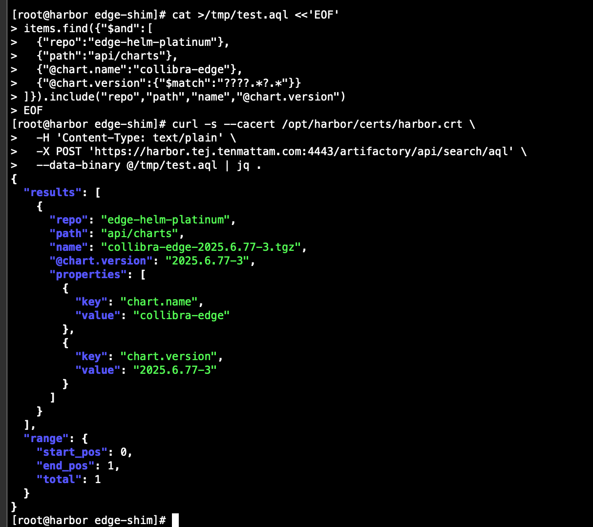
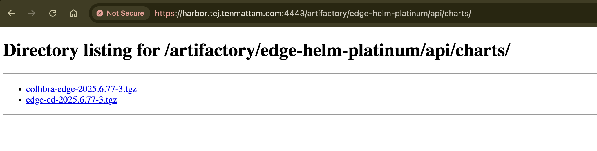
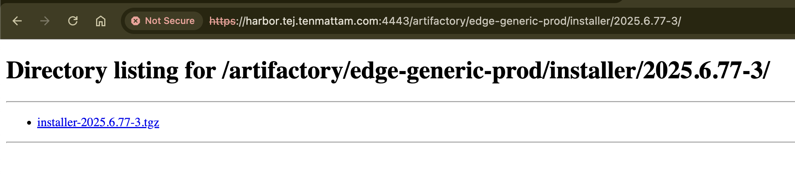

# 2. Host the Helm Repository (Shim + NGINX + AQL)

> **Goal:** Serve Edge Helm charts from an internal endpoint. A tiny Python shim exposes AQL‑style queries and NGINX provides TLS on a custom port (e.g., `4443`).

## 2.0 Prepare the repository structure and pull charts
```bash
mkdir -p /srv/edge-repo/edge-helm-platinum/api/charts
mkdir -p /srv/edge-repo/edge-generic-prod/installer/2025.6.77-3

# Example pulls (replace versions and tokens)
helm pull https://repository.collibra.io/artifactory/edge-helm-platinum/api/charts/collibra-edge-2025.6.77-3.tgz   --username <edge-customer-id> --password <token>

helm pull https://repository.collibra.io/artifactory/edge-helm-gold/api/charts/edge-cd-2025.6.77-3.tgz   --username <edge-customer-id> --password <token>

PASS_CLOUD='<token>'
curl -fL -H "Authorization: Bearer $PASS_CLOUD"  -O "https://repository.collibra.io/artifactory/edge-generic-prod/installer/2025.6.77-3/installer-2025.6.77-3.tgz"
```

## 2.1 Run the shim and front it with NGINX/TLS
```bash
# Copy your shim to the host
mkdir -p /opt/edge-shim
cp scripts/edge_shim.py /opt/edge-shim/

# Start shim on 8080 (logs to /var/log/edge-shim.log)
nohup python3 /opt/edge-shim/edge_shim.py --root /srv/edge-repo --port 8080   >/var/log/edge-shim.log 2>&1 &

# NGINX reverse proxy with TLS on 4443
sudo mkdir -p /opt/edge-nginx/conf.d
sudo cp scripts/edge-nginx.conf /opt/edge-nginx/conf.d/edge-shim.conf

docker rm -f edge-nginx
docker run -d --name edge-nginx --restart=always --network host   -v /opt/edge-nginx/conf.d:/etc/nginx/conf.d:ro   -v /opt/harbor/certs:/etc/nginx/certs:ro   nginx:stable

# Open the firewall
sudo firewall-cmd --add-port=4443/tcp --permanent
sudo firewall-cmd --reload
```

### Generate `index.yaml` for Helm
```bash
BASE="https://harbor.<YOUR_DOMAIN>:4443/artifactory/edge-helm-platinum"
cd /srv/edge-repo/edge-helm-platinum
helm repo index api/charts --url "$BASE/api/charts"
mv api/charts/index.yaml index.yaml

# Sanity‑check it serves
curl -sS --cacert /opt/harbor/certs/harbor.crt "$BASE/index.yaml" | head -n 20
```

### Test the AQL endpoint
```bash
cat >/tmp/test.aql <<'EOF'
items.find({"$and":[
 {"repo":"edge-helm-platinum"},
 {"path":"api/charts"},
 {"@chart.name":"collibra-edge"},
 {"@chart.version":{"$match":"????.*?.*"}}
]}).include("repo","path","name","@chart.version")
EOF

curl -s --cacert /opt/harbor/certs/harbor.crt   -H 'Content-Type: text/plain'   -X POST 'https://harbor.<YOUR_DOMAIN>:4443/artifactory/api/search/aql'   --data-binary @/tmp/test.aql | jq .
```




