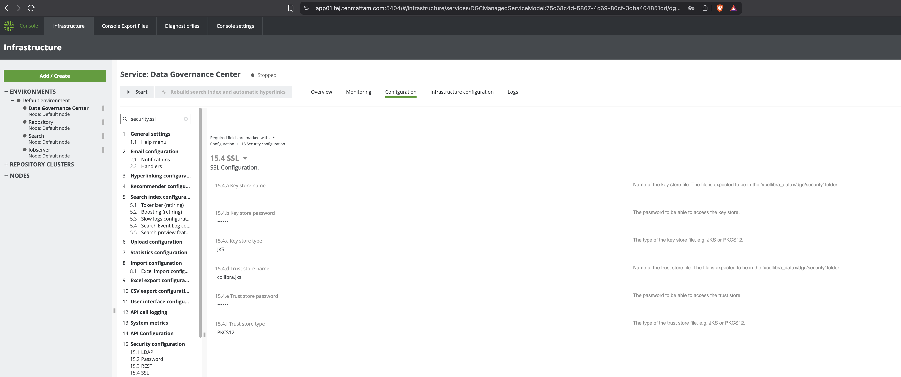
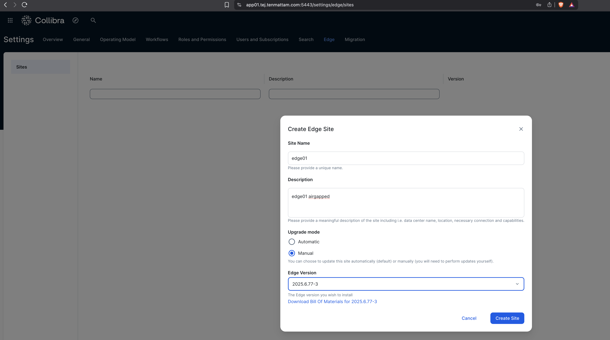
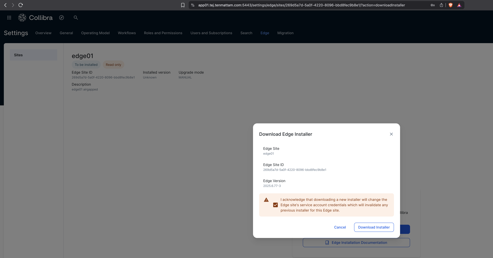

# 3. Enable Edge for CPSH

> **Goal:** Trust the Harbor shim certificate in CPSH and configure Edge settings via the Console API.

## 3.1 Import the Harbor cert into CPSH (if self‑signed)
```bash
# Export the server certificate (adjust host/port)
openssl s_client -connect harbor.<YOUR_DOMAIN>:443 -servername harbor.<YOUR_DOMAIN> </dev/null 2>/dev/null | sed -ne '/-BEGIN CERTIFICATE-/,/-END CERTIFICATE-/p' | tee /opt/collibra_data/dgc/security/harbor-shim.crt

# Import into the Collibra trust store
sudo keytool -importcert -alias harbor-shim   -file /opt/collibra_data/dgc/security/harbor-shim.crt   -keystore /opt/collibra_data/dgc/security/collibra.jks   -storepass '<PASSWORD>' -storetype PKCS12 -noprompt
```

> **DGC SSL settings (example):**
> - Trust store name: `collibra.jks`
> - Trust store password: `<PASSWORD>`
> - Trust store type: `PKCS12`



## 3.2 Configure Edge via Console API

Send the following API request to Collibra Console, with the variables for your CPSH (run this on cpsh node):
Note: Update the DGC service model UUID. Instructions are [here:](https://productresources.collibra.com/docs/cpsh/latest/Content/Installation/CPSH/ta_enable-edge-cpsh.htm)

```bash
# Grab platform CA (adjust host/port)
echo -n | openssl s_client -connect app01.<YOUR_DOMAIN>:5404 -showcerts  | sed -ne '/-BEGIN CERTIFICATE-/,/-END CERTIFICATE-/p' > /tmp/platform-ca.pem

# Update DGC service model UUID and credentials as appropriate
curl -v --user '<ADMIN_USER>:<ADMIN_PASS>' -X POST "https://app01.<YOUR_DOMAIN>:5404/rest/dgc/configuration/<DGC_SERVICE_UUID>/json"   -H 'Content-Type: application/json'   --cacert /tmp/platform-ca.pem   --data-raw '{
    "edgeConfiguration": {
      "artifactoryUser": "edge-shim",
      "artifactoryToken": "edge-shim",
      "artifactoryUri": "https://harbor.<YOUR_DOMAIN>:4443/artifactory/",
      "artifactoryRepoKey": "edge-helm-platinum",
      "signalfxToken": "DisabledForCPSH",
      "datadogToken": "DisabledForCPSH"
    }
  }'
```

> After applying, restart the environment as needed, then create an **Edge site** in DGC Console → Settings → Edge → *Create Site*.



> Download the Installer and scp to the edge node:

