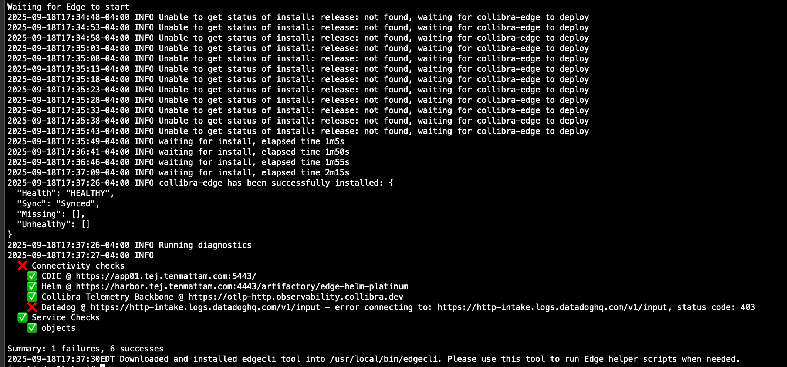
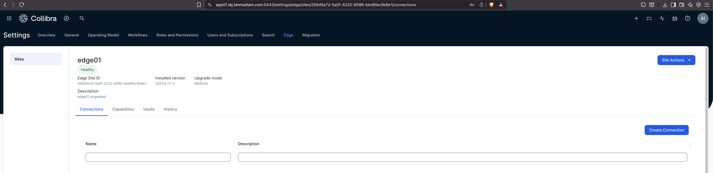

# 4. Prepare the Air‑gapped Edge Node

## 4.0 Trust CA chain on the Edge node
```bash
# Build platform chain
echo -n | openssl s_client -connect app01.<YOUR_DOMAIN>:5404 -showcerts  | sed -ne '/-BEGIN CERTIFICATE-/,/-END CERTIFICATE-/p' > /tmp/platform-ca.pem

# Append Harbor CA (ensure 3.1 completed)
openssl s_client -connect harbor.<YOUR_DOMAIN>:443 -servername harbor.<YOUR_DOMAIN> </dev/null 2>/dev/null | sed -ne '/-BEGIN CERTIFICATE-/,/-END CERTIFICATE-/p' > /tmp/harbor-ca.crt

cat /tmp/harbor-ca.crt >> /tmp/platform-ca.pem
update-ca-trust extract
```

## 4.1 Extract the installer
```bash
cd /tmp && tar -xzf installer-<UUID>.tgz
```

## 4.2 Check `/tmp/properties.yaml` (example)
```yaml
namespace: collibra-edge
collibra_edge_app:
  helmRepo: https://harbor.<YOUR_DOMAIN>:4443/artifactory/edge-helm-platinum
  targetVersion: 2025.6.77-3
  selfHeal: true
collibra_edge:
  global:
    collibra:
      fedramp: false
      siteId: <SITE_UUID>
      siteType: ON_PREM
      installerVersion: "2025.6.77-3"
      platformId: https://app01.<YOUR_DOMAIN>:5443/
      edge_log_index: edge-prod
    datadog:
      site: datadoghq.com
```

## 4.3 Create `registries.yaml` from the example
Use the provided `registries.example.yaml` template and keep your real `registries.yaml` **out of the repo**.
```bash
cp registries.example.yaml /tmp/registries.yaml
```

## 4.4 Run the Edge installer
```bash
export ROBOT_USER='robot$edge-all'
export ROBOT_TOKEN='<ROBOT_TOKEN>'
cd /tmp
./install-master.sh /tmp/properties.yaml   -r /tmp/registries.yaml   --registry-url harbor.<YOUR_DOMAIN>   --registry-user "${ROBOT_USER}"   --registry-pass "${ROBOT_TOKEN}"   --ca /tmp/platform-ca.pem   --ignore-monitoring-requirements
```


