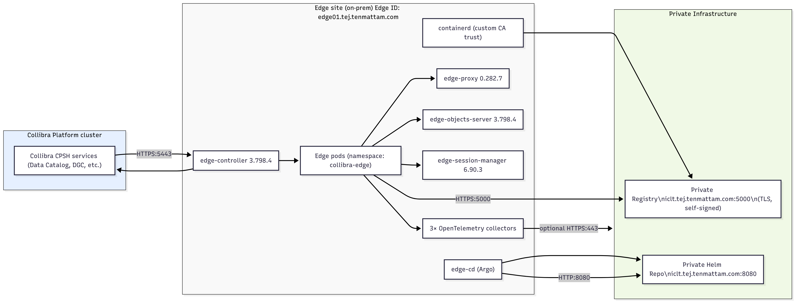
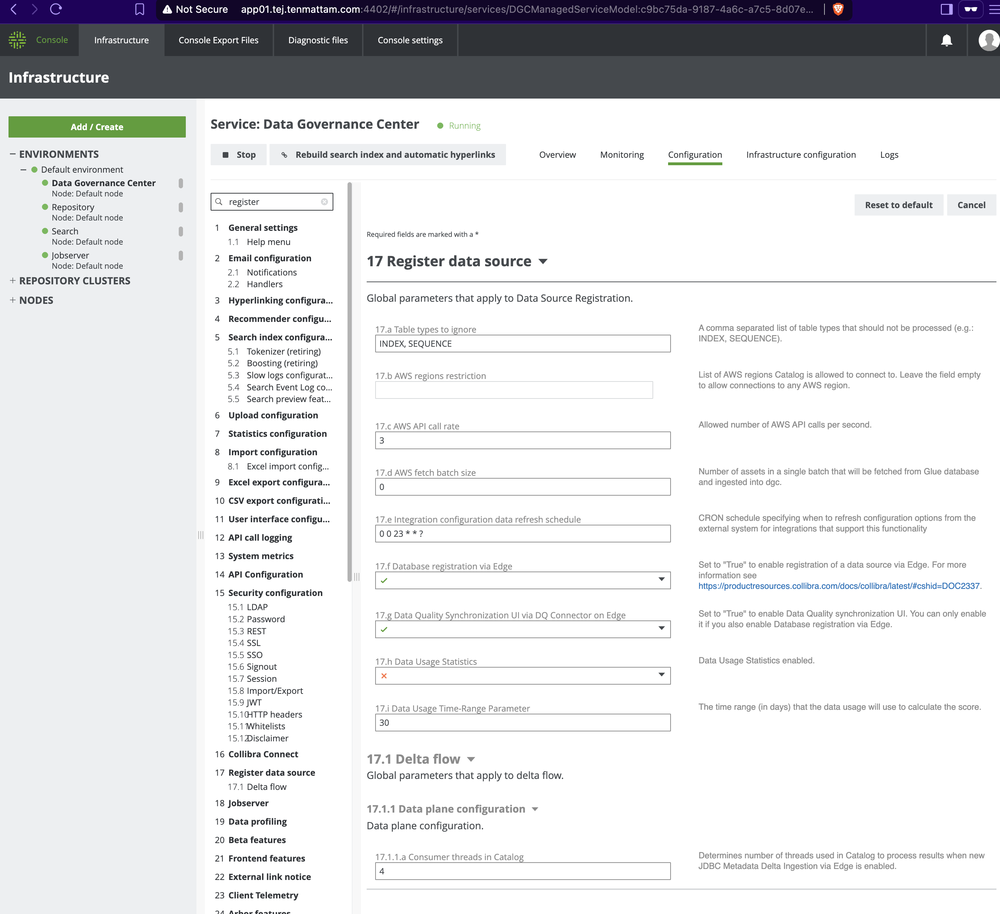

# Collibra Edge Air‑gapped Installation — Using Harbor Registry

## Scope
Collibra CPSH and Edge nodes are **fully air‑gapped**. 

Harbor hosts:
- Collibra Edge container images (mirrored locally), and
- Helm charts (served via a simple shim + NGINX/TLS on a custom port).

## Prerequisites (high level)
- You have a [global role](https://productresources.collibra.com/docs/cpsh/latest/Content/Settings/RolesAndPermissions/Roles/GlobalRoles/to_global-roles.htm) with permission to **[Manage Edge sites](https://productresources.collibra.com/docs/cpsh/latest/Content/Settings/RolesAndPermissions/Permissions/co_global-permissions.htm)**.
- Edge site [system requirements](https://productresources.collibra.com/docs/cpsh/latest/Content/Edge/EdgeSitesInstallation/ref_edge-site-system-requirements.htm) are satisfied (CPU/RAM/disk, OS, connectivity).
- [Database registration](https://productresources.collibra.com/docs/cpsh/latest/Content/Settings/ServicesConfiguration/ta_enable-data-registration-via-edge.htm) via Edge is enabled in Collibra Console.

## Navigation
- [1. Harbor Setup](01-harbor.md)
- [2. Helm Repo (Shim + NGINX + AQL)](02-helm-repo.md)
- [3. Enable Edge for CPSH](03-enable-cpsh.md)
- [4. Prepare the Edge Node](04-edge-node.md)
- [5. Verify & Troubleshoot](05-verify.md)
- [6. Uninstall](06-uninstall.md)
